[](https://explorer.solana.com/address/3o6We5WQoGDM6wpQMPq5VE3fjvC7zgCUD56X12vLn917?cluster=devnet)
[](LICENSE)
[](https://github.com/YYurq/Orbital_Pulse_Blockchain-Proof_of_Pause/actions)
[](https://github.com/YYurq/Orbital_Pulse_Blockchain-Proof_of_Pause/stargazers)

# ORBITAL Pulse Blockchain  
**Proof of Pause / Proof of Pulse**

On-chain implementation of the **Law of Admission** and **TPAPCI**
(Theory of Phase Architecture of Pulsational Convergence of Information)
on the Solana blockchain.

---

## Overview

**Orbital Pulse Blockchain** is an experimental on-chain protocol that implements
a deterministic emission system with an element of external noise.
The system formalizes the idea of *pause* as a measurable and verifiable state
derived from blockchain hash entropy.

Token emission occurs **only** when the system reaches a resonant state
(Proof of Pause), demonstrating the principle of *noise as fuel*.

---

## Core Concepts

### Law of Admission
A system transition is permitted only when internal state, external noise,
and admissible thresholds converge within a defined tolerance.

### TPAPCI
**Theory of Phase Architecture of Pulsational Convergence of Information** —
a theoretical framework describing how information systems self-organize
through phase states, pulsations, and resonance under noisy conditions.

### Proof of Pause/Pulse (PoP)
A consensus-independent emission trigger based on:
- hash entropy
- deterministic state checks
- epsilon-based admissibility conditions

## Technical Implementation

### Phase States
- **S0 (IDLE)** - Resonant pause state, token emission enabled
- **S1 (CONTROL)** - High entropy, maximum control
- **S2 (EVOLVE)** - Adaptive state, system adjusting

### Key Parameters
- **ε (epsilon)** - Vacuum state baseline (median of 16 samples)
- **Variance Index** - Log-compressed system energy
- **X_control** - Adaptive control force
- **Gradient** - Rate of energy change

### Emission Condition
```
mode == S0 AND δ < ε  →  MINT 0.1 $ORBIT
```

### Orbital Mechanics (Proof-of-Pause)

The protocol implements a deterministic, entropy-reactive emission model where $ORBIT minting is governed by algorithmic noise analysis and adaptive spectral filters.

* **Fine Log** — Deterministic logarithmic normalization of raw block entropy using u128 fixed-point arithmetic.
* **EMA Trend** — Deterministic inertial projection using 4:1 integer-weighted averaging, eliminating floating‑point nondeterminism while suppressing stochastic network noise.
* **Adaptive Depth** — Self-adjusting scanning window (7–15 slots) with **Gradient Hysteresis (%)**, preventing micro‑oscillation during volatility spikes.
* **Resonance Check** — Phase continuity verification where minting occurs only when both instantaneous delta and inertial index fall below the resonance threshold.

### Technical Architecture: Orbital Flow

```mermaid
graph TD
    Start([Initialize]) --> Calib{Born?}
    
    %% Calibration
    Calib -->|No| Hash1[Slot Hash]
    Hash1 --> Delta1[Δ Noise]
    Delta1 --> Collect[Collect 16<br/>samples]
    Collect --> Eps[ε = median]
    Eps --> Born[Born ✓]
    
    %% Working Cycle
    Calib -->|Yes| Hash2[Slot Hash]
    Born --> Hash2
    Hash2 --> Delta2[Δ Noise]
    Delta2 --> Var[Variance]
    Var --> EMA[EMA 80:20]
    EMA --> Grad[Gradient]
    
    %% Modes
    Grad --> Mode{Mode}
    Mode -->|Low| S0[S0 IDLE]
    Mode -->|High| S2[S2 EVOLVE]
    Mode -->|Max| S1[S1 CONTROL]
    
    S2 --> S0
    S2 --> S1
    S1 --> S0
    
    %% Emission
    S0 --> Check{Δ < ε?}
    Check -->|Yes| Mint[[🪙 MINT<br/>0.1 ORBIT]]
    Check -->|No| Loop[Continue]
    S1 --> Loop
    S2 --> Loop
    Mint --> Loop
    Loop --> Hash2
    
    %% Light theme styling
    style Start fill:#e3f2fd,stroke:#1976d2,stroke-width:2px
    style Eps fill:#fff3e0,stroke:#f57c00,stroke-width:2px
    style Born fill:#e8f5e9,stroke:#388e3c,stroke-width:2px
    
    style S0 fill:#c8e6c9,stroke:#2e7d32,stroke-width:3px
    style S1 fill:#ffcdd2,stroke:#c62828,stroke-width:3px
    style S2 fill:#bbdefb,stroke:#1565c0,stroke-width:3px
    
    style Mint fill:#a5d6a7,stroke:#2e7d32,stroke-width:4px
    style Check fill:#fff9c4,stroke:#f9a825,stroke-width:2px
    style Mode fill:#fff9c4,stroke:#f9a825,stroke-width:2px
```


---

## On-chain Implementation

- **Program ID**:  
  `3o6We5WQoGDM6wpQMPq5VE3fjvC7zgCUD56X12vLn917`

- **Network**:  
  Solana Devnet

- **Framework**:  
  Anchor (Rust)

The program:
1. Initializes a system state
2. Evaluates entropy-derived parameters
3. Detects resonant pause states
4. Emits the $ORBIT token only when conditions are satisfied

Each successful initialization represents an independent and verifiable
genesis event recorded on-chain.

---
## Network Verification (Proof of Concept)

To verify the functionality of the **Proof-of-Pause** algorithm and compliance with the **Law of Admission**, you can inspect the program state and related assets in real time on the Solana blockchain:

- **Program ID (Core):**  
  [`3o6We5...vLn917`](https://explorer.solana.com/address/3o6We5WQoGDM6wpQMPq5VE3fjvC7zgCUD56X12vLn917?cluster=devnet)

- **Genesis Mint ($ORBIT):**  
  [`JDveDC...vyjf`](https://explorer.solana.com/address/6feTb4jAUJFkw5Cd1NQGXkUPtHhLnocyDL9S7Q9niuVE?cluster=devnet)

### How to Verify Proof of Pause

In the Solana Explorer, open the **History** section of the Program ID or the mint account.
A reward of `0.1 $ORBIT` appears **only** when the mathematical pause condition  
`delta < epsilon` is successfully satisfied by the program logic.

This guarantees that asset emission is governed by deterministic constraints and
formal admissibility rules, rather than randomness or external intervention.

---

## Repository Structure
```text
.
├── github
│   ├── ISSUE_TEMPLATE
│   │   ├── bug_report.md:
│   │   └── feature_request.md
│   ├── workflows
│   │   └── anchor.yml
│   └── PULL_REQUEST_TEMPLATE.md
├── programs
│   └── orbital_pulse
│       ├── Cargo.toml
│       └── src
│           └── lib.rs
├── tests
│   └── anchor.test.ts
├── docs
│   ├── Zakon_Dostupa_RU.pdf
│   └── Theory_TFAPSI_RU.pdf
├── Anchor.toml
├── Cargo.toml
├── CODE_OF_CONDUCT.md
├── CONTRIBUTING.md
├── client
├── License
├── gitignore
└── README.md
```
---

## Documentation

### Russian (Original Works)
- **Law of Admission** — formal statement and axioms  
  `docs/Law_of_Admission_(RU).pdf`

- **TPAPCI** — theoretical foundation and phase model  
  `docs/TPAPCI_Theory_(RU).pdf`

### English Summary

This project implements the *Law of Admission* as an on-chain system
where information convergence is governed by phase stability and noise.
The blockchain acts as an external entropy source and a verifier of state transitions.

---

## Scientific Status

This repository represents:
- a formalized theoretical model
- an on-chain executable experiment
- a reproducible proof of implementation

The blockchain serves as:
- timestamp authority
- state verifier
- immutable record of authorship and priority

---

## License

Recommended: **Apache License 2.0**  
Ensures openness while protecting the author from patent capture.

---

## Author

© 2026 — **Yuri Slaschev**
